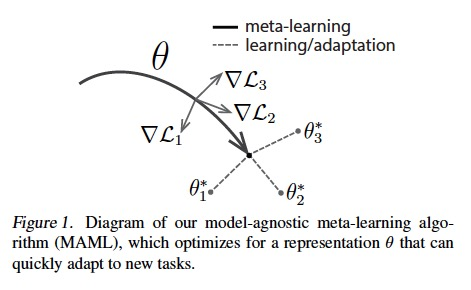
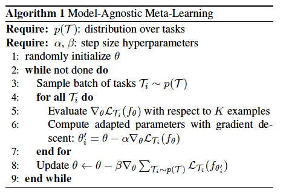
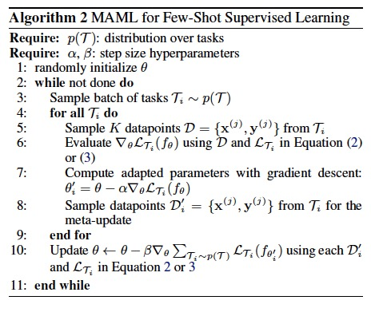

# [Model-Agnostic Meta-Learning for Fast Adaptation of Deep Networks](https://arxiv.org/pdf/1703.03400.pdf)

Related article: 
- [Learning to learn](https://bair.berkeley.edu/blog/2017/07/18/learning-to-learn/)
- Some useful explanations of MAML: 
    - [Model-Agnostic Meta-Learning](https://danieltakeshi.github.io/2018/04/01/maml/)
    - [What is Model-Agnostic Meta-learning (MAML) ?](https://towardsdatascience.com/model-agnostic-meta-learning-maml-8a245d9bc4ac)

### Overview
#### Idea:
Train neural network parameters *θ* on a distribution of tasks so that, when faced with a new task, can be rapidly adjusted through just a few gradient steps.

#### Goal:
Quickly adapt to new tasks on distribution with only small amount of data and with only a few gradient steps, even one gradient step.

#### Contribution:
The primary contribution of this work is a simple model and task-agnostic algorithm for meta-learning that trains a model’s parameters such that a small number of gradient updates will lead to fast learning on a new task.

### Introduction

- The MAML learner’s weights are updated using the gradient, rather than a learned update.
    - Not need additional parameters nor require a particular learner architecture.
- **Fast adaptability** through good parameter initialization,
    - Explicitly optimizes to learn Internal representation (i.e. suitable for many tasks).
    - Maximizes sensitivity of new task losses to the model parameters.

- The intuition behind MAML is that some internal representations are more transferrable than others. 
    - For example, a neural network might learn internal features that are broadly applicable to all tasks in *p(T)*, rather than a single individual task.

### MAML Algorithm

We can see that the parameters *θ* are close to all the 3 optimal parameters of task 1, 2, and 3 which makes *θ* the best parameters initialization that can quickly adapt to different new tasks. 
As a result, only a small change in the parameters *θ* will lead to an optimal minimization of the loss function of any task.

Here is the algorithm:

### MAML for few-shot learning

In meta-training, all the tasks are treated as training examples *p(T)*. So, we start with randomly choosing the parameters *θ*, and we enter the first loop (while) that takes a batch of tasks from *p(T)*. And for each task from that batch, we train the model *f* using k examples of that task (k-shot learning). Then, we get the feedback of its loss function, and test it on new example test set to improve the model’s parameters.
