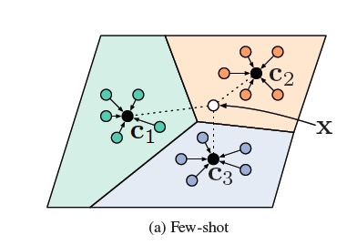
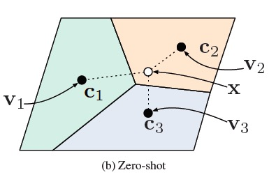
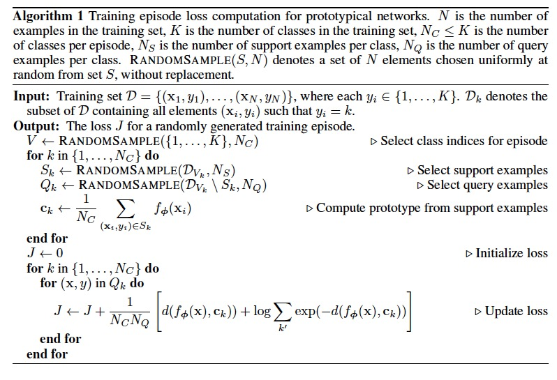
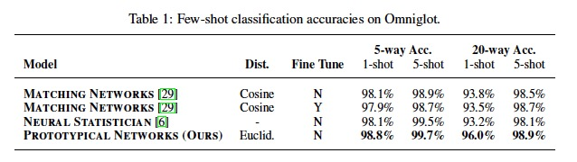
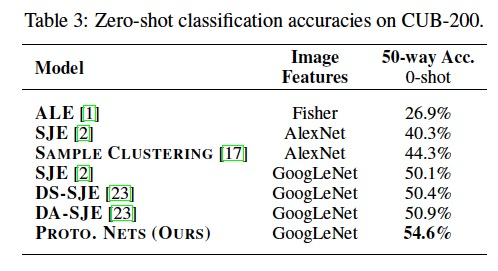

# [Prototypical Networks for Few-shot Learning](https://arxiv.org/pdf/1703.05175.pdf) 
***Jake Snell, Kevin Swersky, Richard S. Zemel***

## Prototypical networks in the few-shot 
- Prototypical network is based on the idea that there exists an embedding in which points cluster around a single prototype representation for each class. 
- In order to do this, they learn a non-linear mapping of the input into an embedding space using a neural network and take a class’s prototype to be the mean of its support set in the embedding space. 
- Classification is then performed for an embedded query point by simply finding the nearest class prototype. 

Few-shot prototypes ck are computed as the mean of embedded support examples for each class. 

## Prototypical networks in the zero-shot
They follow the same approach to tackle zero-shot learning:
- each class comes with meta-data giving a high-level description of the class rather than a small number of labeled examples. 
- then learn an embedding of the meta-data into a shared space to serve as the prototype for each class. 
- classification is performed, as in the few-shot scenario, by finding the nearest class prototype for an embedded query point. 

### Detail 
- Zero-shot learning differs from few-shot learning in that instead of being given a support set of training points, we are given a class meta-data vector vk for each class, which could be determined in advance, or could be learned from raw text (this method is from paper: Zero-shot learning using purely textual descriptions).
- They simply define ck = g(vk)  to be a separate embedding of the meta-data vector. 
- Since the meta-data vector and query point come from different input domains, they found it was helpful empirically to fix the prototype embedding g to have unit length, however they do not constrain the query embedding f.

Zero-shot prototypes ck are produced by embedding class meta-data vk. 

## Pseudocode to compute the loss

## Experiment
- For few-shot learning, they performed experiments on Omniglot. They trained prototypical networks using Euclidean distance in the 1-shot and 5-shot scenarios with training episodes containing 60 classes and 5 query points per class.

- For zero-shot learning, they run experiments on the Caltech-UCSD Birds (CUB) 200-2011 dataset, which contains 11,788 images of 200 bird species.
    - They divide the classes into 100 training, 50 validation, and 50 test.
    - For images, using 1024-dimensional features extracted by applying GoogLeNet to middle, upper left, upper right, lower left, and lower right crops of the original and horizontally-flipped image.
    - For test, only using the middle crop of the original image.
    - For class meta-data, using the 312-dimensional continuous attribute vectors provided with the CUB dataset. These attributes encode various characteristics of the bird species such as their color, shape, and feather patterns.

