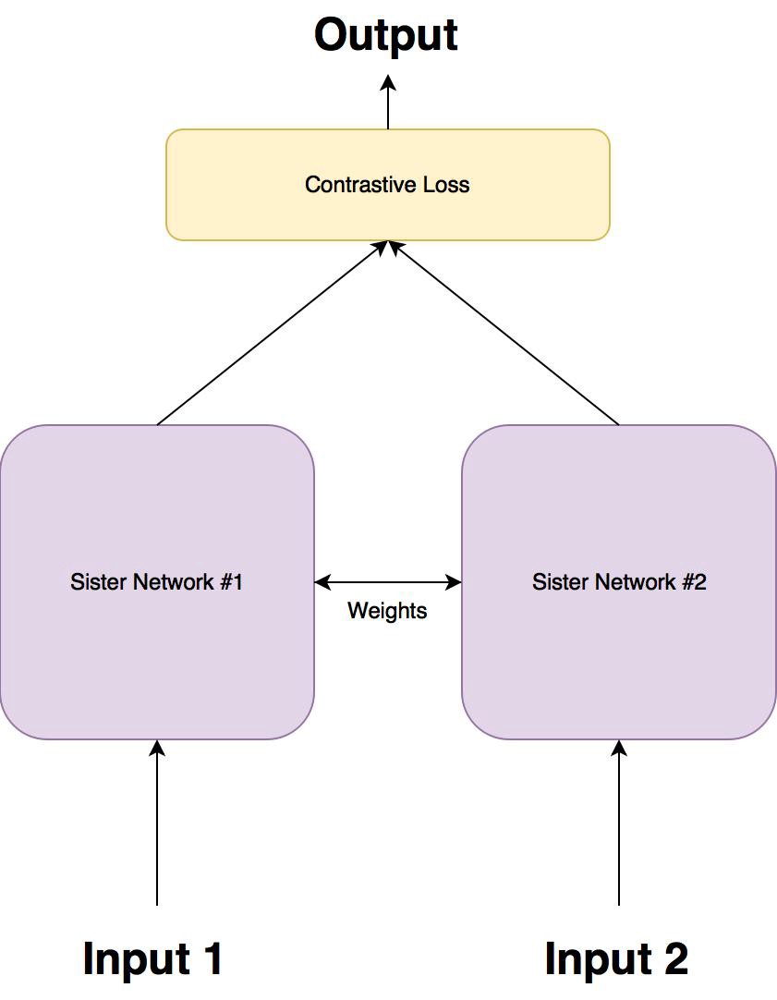

# Siamese Network

## Related Papers
```
These are some papers about siamese network and triplet network.
```
- [Siamese Neural Networks for One-Shot Image Recognition](https://www.cs.cmu.edu/~rsalakhu/papers/oneshot1.pdf)
- [FaceNet: A Unified Embedding for Face Recognition and Clustering](https://arxiv.org/pdf/1503.03832.pdf)
- [Deep Metric Learning Using Triplet Network](https://arxiv.org/pdf/1412.6622.pdf)

## Architecture
Siamese network is a special type of neural network architecture. Instead of a model learning to classify its inputs, the neural networks learns to differentiate between two inputs. It learns the similarity between them.


A Siamese networks consists of two identical neural networks, each taking one of the two input images. The last layers of the two networks are then fed to a contrastive loss function, which calculates the similarity between the two images.

There are two sister networks, which are identical neural networks, with the exact **same weights**. The networks are optimized using a **contrastive loss function**.

### Loss Function
The contrastive loss function is given as follows:


where **Dw** is defined as the euclidean distance between the outputs of the sister siamese networks. Mathematically the **euclidean distance** is:

where **Gw** is the output of one of the sister networks. **X1** and **X2** is the input data pair.
where **m** is a margin(m>0). The margin defines a radius around **Gw**. Dissimilar pairs contribute to the loss function only if their distance is within this radius. This makes sense, because we would only want to optimize the network based on pairs that are actually dissimilar, but the network thinks are fairly similar.
